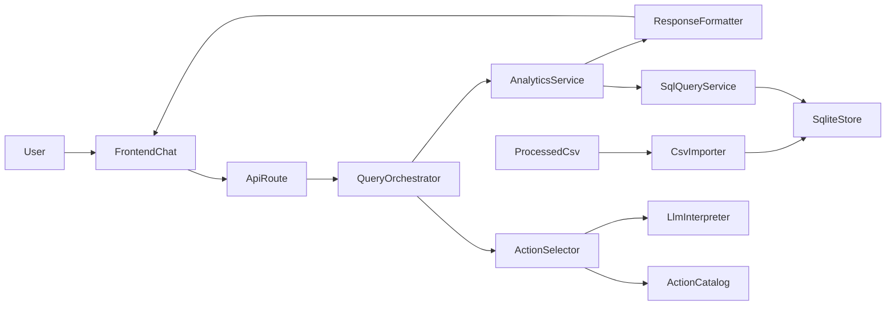

# ShopSight Prototype Plan

## Starting Point

- Current workspace appears to be mostly uninitialized.
- Existing backend entrypoint: [Shop/backend/app.py](Shop/backend/app.py) is present but empty.
- Expected source data location: [Shop/data/processed_data.csv](Shop/data/processed_data.csv).
- No discoverable React frontend scaffold was found, so the plan assumes [Shop/frontend](Shop/frontend) will be created from scratch.

## Product Slice

Build one polished analytics conversation end to end:

- User asks a plain-English e-commerce question in a chat UI.
- Frontend sends the message to a Python API.
- Backend uses an LLM-powered lightweight agent to classify/structure the request into a supported analytics action.
- Backend maps the request to a supported SQL-backed analytics flow using action metadata, queries SQLite, and returns:
  - a short natural-language insight
  - a primary metric/card
  - a simple visual payload such as a bar/line chart or ranked table
- Frontend renders the response as a clean, demoable chat result.

## Recommended Demo Scope

Use one reliable question family for the first prototype, based on an assumed e-commerce schema.
Example supported prompts:

- "What were the top-selling products last month?"
- "Which category drove the most revenue this week?"
- "Show me sales trend by day for the last 30 days."

Implementation strategy:

- Keep the LLM responsible for selecting from a constrained action catalog and normalizing parameters.
- Keep SQLite responsible for the actual analytics queries.
- Treat `processed_data.csv` as the import source, not the live query engine.
- Introduce a lightweight agent metadata file made of JSON objects with:
  - `action_type`
  - `output_type`
- Use that metadata as the contract between natural-language interpretation and SQL generation/execution.
- Restrict the first version to a small supported-intent registry so the demo is dependable.

## Architecture




## Backend Plan

Create a clean Python structure under [Shop/backend](Shop/backend) using clean architecture best principles:

- API layer: entrypoint and HTTP routes in `app.py` plus request/response schemas.
- Application layer: `QueryOrchestrator` use case that coordinates action selection, LLM parsing, and analytics execution.
- Domain layer: supported analytics actions, parameter models, and response contracts.
- Infrastructure layer: SQLite access, CSV import/bootstrap, and an LLM adapter.

Suggested responsibilities:

- `app.py`: bootstrap server and register one `/chat` endpoint.
- `application/query_orchestrator.py`: validate request, load action metadata, call the action selector/LLM interpreter, and dispatch to analytics service.
- `domain/actions.py`: define the first supported action types and response expectations.
- `domain/action_catalog.json`: list the allowed actions as JSON entries containing `action_type` and `output_type`.
- `infrastructure/data/csv_importer.py`: ingest `processed_data.csv` into SQLite on startup or via a bootstrap step.
- `infrastructure/data/sqlite_repository.py`: run parameterized queries against the SQLite database.
- `infrastructure/llm/…`: adapt to the chosen LLM provider behind an interface.

Lightweight agent behavior:

- The model does not invent arbitrary tools or SQL paths.
- It receives the action catalog as metadata and must choose the best matching `action_type`.
- `output_type` informs the expected frontend rendering contract, such as KPI card, time-series chart, leaderboard table, or mixed result.
- SQL generation stays templated or strongly constrained per action so the prototype remains reliable.
- Follow-up handling:
  - The backend uses a follow-up gating rule so that explicit “new” queries (e.g. asking for “most/top/highest revenue”) are not incorrectly treated as follow-ups.
  - Implementation locations:
    - `Shop/backend/application/query_orchestrator.py` merges or skips action selection based on `is_followup` + `followup_context`.
    - `Shop/backend/Infrastructure/llm/action_selector.py` implements `has_explicit_action_match()` which returns `True` for:
      - `revenue` with `last ...` / `within ...`
      - **explicit leaderboard revenue phrasing** such as `most revenue`, `top revenue`, `highest revenue`, etc.
    - If classified as explicit new query: action selection runs and the SQL-backed `action_type` executes again.
    - If classified as follow-up: the system answers from prior context only (no new action execution).

## Frontend Plan

Create a React app under [Shop/frontend](Shop/frontend) with navigation rooted in `App.js` and folders for `pages` and `components`.

Recommended frontend structure:

- `src/App.js`: app shell and route setup.
- `src/pages/IntroPage.jsx`: the first page which introduces the application, allows us to click a button to extract shopping insights and go to the ChatPage.
- `src/pages/ChatPage.jsx`: the main demo surface.
- `src/components/ChatInput.jsx`: prompt composer.
- `src/components/MessageList.jsx`: conversation history.
- `src/components/InsightCard.jsx`: key takeaway + KPI.
- `src/components/ResultChart.jsx`: chart renderer.
- `src/components/ResultTable.jsx`: ranked rows where helpful.

UI direction based on the provided reference:

- Keep a split layout, but simpler than the mock.
- Left: chat and result narrative.
- Right: visual analytics panel that updates with the latest answer.
- Use a restrained design system: clear spacing, soft cards, one accent color, strong typography.
- Seed the interface with 3 suggested prompts so the demo starts smoothly.

## Data Contract Assumption

Plan the first version around a simplified e-commerce transaction dataset:

- `article_id` (product/article identifier)
- `t_dat` (transaction date, `YYYY-MM-DD`)
- `price` (float revenue per transaction row)
- `prod_name` (product name)

SQLite plan:

- `transactions_sampled_articles.csv` remains the raw input file.
- The backend imports the CSV into a local SQLite database for querying.
- The first version should use a single normalized transactions table matching the CSV schema.
- Each supported action maps to a known SQL template or query builder path.

The backend should fail gracefully if required columns are missing during import or query setup:

- return a clear unsupported-data message
- avoid crashing the chat flow
- fall back cleanly when no supported `action_type` matches the user request

Database schema (single table):

- Table: `transactions`
- Columns:
  - `article_id` (declared as primary key component; CSV repeats article_id across multiple rows)
  - `t_dat` (date string, `YYYY-MM-DD`)
  - `price` (float)
  - `prod_name` (string)

Analytics SQL queries (executed by the “top products” action):

Query 1: count transactions per product (used to find the most sold product)

```sql
SELECT
  prod_name,
  COUNT(*) AS transaction_count
FROM transactions
WHERE t_dat BETWEEN ? AND ?
GROUP BY prod_name
ORDER BY transaction_count DESC;
```

Query 2: total revenue per product (used to find the product with most revenue)

```sql
SELECT
  prod_name,
  SUM(price) AS total_revenue
FROM transactions
WHERE t_dat BETWEEN ? AND ?
GROUP BY prod_name
ORDER BY total_revenue DESC;
```

Derivations from the query outputs:

- `most_sold`: the first row of Query 1 (highest `transaction_count`)
- `most_revenue`: the first row of Query 2 (highest `total_revenue`)
- the revenue leaderboard table (ranked rows shown to the LLM) is built from Query 2:
  - **Important current behavior (to support correct “most revenue” insights):**
    - `PRODUCTS_SALES_REVENUE_OVERVIEW` now includes **ALL rows** from Query 2 in `ChatResponse.table.rows`
      - this ensures the LLM insight generator has complete revenue-per-product context.
    - the **chart** remains focused on the top-N subset (currently top `5`) for visual clarity.

Action types used in this prototype slice (the ones that drive revenue-by-product insights):
- `PRODUCTS_SALES_REVENUE_OVERVIEW` (output_type: `table`)
  - SQL: Query 2 (`SUM(price) AS total_revenue` grouped by `prod_name`, ordered by `total_revenue DESC`)
  - Response:
    - `table.columns`: `["Metric", "Product", "Total revenue"]`
    - `table.rows`: includes
      - `Most revenue`, `Least revenue`
      - `Top revenue` rows for all products (to power LLM context)
    - `chart.x/series`: top-N products only (top 5)
  - LLM insight context:
    - built from `resp.table.columns` + `resp.table.rows` in `Shop/backend/infrastructure/llm/insight_generator.py`
- `PRODUCTS_SALES_COUNT_OVERVIEW` (output_type: `table`)
  - SQL: Query 1 (`COUNT(*) AS transaction_count` grouped by `prod_name`)
  - Response:
    - `table.columns`: `["Metric", "Product", "Transactions"]`
- `REVENUE_WITHIN_TIMEFRAME` (output_type: `table`)
  - SQL: timeframe-bounded Query 2 (same aggregation, `t_dat BETWEEN start AND end`)
  - Used when the prompt contains explicit windows like “last week/last month/last N days”.
- `CATEGORY_REVENUE_THIS_WEEK` and `SALES_TREND_BY_DAY_LAST_30`
  - present in the action catalog, but may raise “not supported” in this simplified transactions-schema prototype.

## Delivery Sequence

1. Scaffold frontend and backend applications.
2. Implement backend contracts, the action metadata schema, and one `/chat` API path.
3. Add a CSV-to-SQLite bootstrap flow and validate the required schema assumptions.
4. Add lightweight agent interpretation constrained to the action catalog.
5. Implement SQLite analytics for one high-confidence demo flow plus one alternate visualization path.
6. Build the chat UI and result components.
7. Connect frontend to backend and add polished loading, empty, and error states.
8. Read expected API environment variables from [Shop/.cursor/rules/env_variables.md](Shop/.cursor/rules/env_variables.md).
9. Validate with a sample CSV and tune the action selection and response format for demo reliability.

## Acceptance Criteria

- User can open the app and ask at least one supported natural-language analytics question.
- The answer is computed from SQLite-backed data imported from `processed_data.csv`, not mocked.
- The request is routed through a lightweight action catalog with metadata entries containing `action_type` and `output_type`.
- The response includes both insight text and a visual/table result.
- The UI feels intentional enough for a product demo.
- The app handles unsupported questions or missing columns gracefully.

